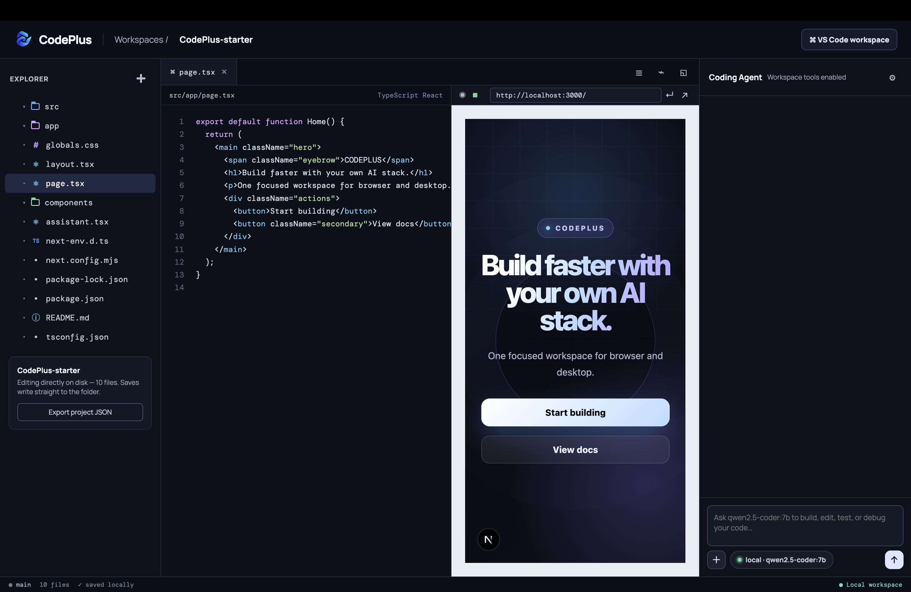

# CodePlus

### v0.1.26 — Codex-style completion details

Coding Agent အလုပ်ပြီးဆုံးချိန်တွင် Codex ကဲ့သို့ `Worked for Xm Ys` ဖြင့် အမှန်တကယ်ကြာချိန်ကို ပြသပြီး၊ အောက်တွင် ပြင်ဆင်ပြီးကြောင်းနှင့် အဓိကပြောင်းလဲမှုများကို တိုတိုချုံးချုံးဖော်ပြပါသည်။ Model ထုတ်သော ရှည်လျားသည့် audit၊ code block နှင့် ထပ်နေသည့်ရှင်းလင်းချက်များကို final result တွင် အလိုအလျောက်ချုံ့ပေးပါသည်။

အောက်ဆုံး **Edited files** card တွင် verified audit အရ အမှန်တကယ်ပြောင်းထားသော file များကိုသာ စာရင်းပြပြီး၊ file တစ်ခုကိုနှိပ်လျှင် editor တွင် တိုက်ရိုက်ဖွင့်ပေးပါသည်။ Web, macOS နှင့် Windows အားလုံးတွင် တူညီသော completion layout ကိုအသုံးပြုပါသည်။

### v0.1.25 — Live agent progress and concise completion

Coding Agent အလုပ်လုပ်နေစဉ် `Reading`, `Editing`, `Writing`, `Running`, `Searching` နှင့် `Inspecting preview` လုပ်ဆောင်ချက်များကို live **Working** card အဖြစ်ပြပြီး၊ ပြီးဆုံးချိန်တွင် `Done`, `Failed` သို့မဟုတ် `Blocked` status ဖြင့် အမှားနှင့်အခြေအနေကိုကြည့်နိုင်ပါသည်။

အလုပ်အားလုံးအောင်မြင်ပြီးနောက် model ထုတ်သော ရှည်လျားသည့် audit/verification report ကို chat ထဲမပြတော့ပါ။ CodePlus ၏ verified change audit ကိုသုံးပြီး **Changes completed** နှင့် အမှန်တကယ်ပြင်ထားသော file များကိုသာ final result အဖြစ်ပြပါသည်။ File result ကိုနှိပ်လျှင် editor တွင် တိုက်ရိုက်ဖွင့်ပေးပြီး Web, macOS နှင့် Windows အားလုံးတွင် behavior တူညီပါသည်။

### v0.1.24 — Project tree controls and desktop file creation

Projects sidebar အောက်ရှိ **Export project JSON** card တစ်ခုလုံးကို ဖယ်ရှားထားပါသည်။ Active project folder ကိုနှိပ်လျှင် file tree ကို show/hide လုပ်နိုင်ပြီး၊ project အတွင်းရှိ nested folder များကို default အနေဖြင့်ပိတ်ထားသောကြောင့် sidebar တစ်ခုလုံး အလိုအလျောက်ပြန့်မနေတော့ပါ။ Folder တစ်ခုချင်းကိုနှိပ်မှသာ ၎င်းအတွင်းရှိ folder နှင့် file များ ပွင့်ပါသည်။

Project name ဘေးရှိ `+` သည် browser-native prompt ကိုမသုံးတော့ဘဲ CodePlus ၏ **New file** dialog ကိုသုံးပါသည်။ Relative path ကိုစစ်ဆေးပြီး browser, macOS နှင့် Windows တွင် တူညီစွာ file/folder ကိုဖန်တီးကာ editor ထဲတိုက်ရိုက်ဖွင့်ပေးပါသည်။

### v0.1.23 — Multi-project sidebar and separate project chats

ဘယ်ဘက် **Explorer** ကို **Projects** ဟု ပြောင်းထားပြီး၊ header ရှိ `Workspaces / project name` ကိုဖယ်ရှားထားပါသည်။ **Projects** ဘေးရှိ `+` မှ ရှိပြီးသား folder ကို open/upload လုပ်နိုင်သလို starter project အသစ်လည်းဖန်တီးနိုင်ပါသည်။

ဖွင့်ထားသော project folder အဟောင်းများကို project အသစ်ဖွင့်တိုင်းမဖယ်ရှားဘဲ Projects list ထဲတွင်ဆက်ထားပြီး တစ်ချက်နှိပ်ကာပြောင်းနိုင်ပါသည်။ Project တစ်ခုချင်းစီ၏ active file, preview URL, browser-memory files နှင့် chat history ကို သီးခြားသိမ်းထားသောကြောင့် project ပြောင်းသော်လည်း အခြား project ၏ chat နှင့် editor state မရောပါ။ Unsaved file ရှိလျှင် မပျောက်စေရန် project switch ကိုတားပြီး save လုပ်ရန်အသိပေးပါသည်။ Web, macOS နှင့် Windows desktop UI အားလုံးတွင် တူညီသော behavior ကိုအသုံးပြုပါသည်။

### v0.1.22 — Fresh file access and measured UI checks

Web and desktop agents now read current disk contents instead of the editor cache. Unsaved editor drafts, files changed since the agent read them, and ambiguous string replacements are protected. No-op writes no longer count as successful changes.

The new `inspect_preview` tool measures visible buttons/links and their parent layout in an isolated Chrome/Edge profile at the preview width, 375px and 1280px. Same-width requests are checked against these measurements before completion, with at most two repair reviews; a mismatch or unavailable measurement is reported honestly instead of passing the model's unsupported success claim through. Matching labels must uniquely identify two visible controls. This is targeted layout verification, not proof that every possible UI behavior is correct.

Preview inspection requires **Node.js 22+**, **Google Chrome or Microsoft Edge**, and a running HTTP localhost dev server on port 1024 or higher. It does not use your signed-in browser profile or reload the embedded preview. Measurements use Chromium, not the macOS embedded WebView. Hosted web instances cannot inspect a user's localhost; use the local web server or desktop app for this feature. The inspector does not automatically install software or start a project server.

Validation: `npm test`, `cargo test --manifest-path src-tauri/Cargo.toml`, and optional real-browser regression `CODEPLUS_BROWSER_TEST=1 node --test tests/preview-inspection.test.mjs`.

### v0.1.21 — Signed desktop updates and public release source

macOS နှင့် Windows in-app update အတွက် မူရင်း updater signing key ကို public release workflow တွင်ပြန်ချိတ်ဆက်ထားပါသည်။ Update icon ကိုနှိပ်လျှင် signed bundle ကို download/install လုပ်ပြီး app ကို restart/reopen လုပ်ပါသည်။ Release တစ်ခုချင်းစီတွင် installer များ၊ verified updater signatures၊ `latest.json` နှင့် matching app source ZIP ပါဝင်ပါသည်။

Private `CodePlus` တွင် `main` source code ကိုသာ push လုပ်ပါသည်။ Public `CodePlus-Releases` တွင် release source snapshot၊ app build workflow၊ release tags နှင့် app downloads ကိုသိမ်းပါသည်။ Public build သည် public source commit မှတိုက်ရိုက်ထုတ်သဖြင့် private deploy key မလိုတော့ပါ။

### v0.1.20 — Codex-style action enforcement

“View docs button width ကို Start building အတိုင်းထားပါ” ကဲ့သို့ actual code change တောင်းသော prompt ကို normal chat အဖြစ်မမှားသတ်မှတ်တော့ဘဲ Coding Agent turn အဖြစ် run ပါသည်။ Coding workspace တွင် confident greeting/general question မဟုတ်သော prompt များကို agent mode အဖြစ် default သတ်မှတ်ပြီး English နှင့် Burmese UI-change wording များကို တိတိကျကျသိရှိနိုင်ပါသည်။

Requested change turn တွင် OpenAI-compatible, Gemini နှင့် Anthropic provider များကို ပထမ response မှာ workspace tool မဖြစ်မနေခေါ်စေပါသည်။ Ollama အပါအဝင် provider အားလုံးတွင် model က real file မပြင်ဘဲ tutorial၊ sample CSS သို့မဟုတ် hypothetical code ဖြင့်ပြီးရန်ကြိုးစားလျှင် ထို reply ကို user chat ထဲမပြဘဲ action gate က workspace ကို inspect/edit/write လုပ်ရန်ပြန်ခိုင်းပါသည်။ File မပြောင်းရသောတစ်ခုတည်းသော valid case သည် relevant file ကိုတကယ်ဖတ်စစ်ပြီး requested state ရှိပြီးသားဖြစ်ကြောင်း concrete evidence ဖြင့်အတည်ပြုနိုင်သည့်အခါသာဖြစ်ပါသည်။ Web၊ macOS နှင့် Windows native backend တို့တွင် တူညီသော orchestration ကိုအသုံးပြုပါသည်။

Desktop installer workflow သည် public `CodePlus-Releases` repository တွင်ရှိပါသည်။

### v0.1.19 — Reliable local-agent verification

GPT-OSS coding turn များတွင် reasoning level ကို `medium` သို့မြှင့်ထားပြီး၊ “View docs ကို Start building နှင့် same width ထားပါ” ကဲ့သို့ ဆက်စပ် UI requirement ကို explicit change contract အဖြစ် model ထံပို့ပါသည်။ Same-width request ကို “width မပြောင်းရ” preserve constraint အဖြစ် မမှားယူတော့ပါ။

File ပြင်ပြီးနောက် verification အတွက် တူညီသော file ကို re-read လုပ်ခြင်းအား workspace revision အသစ်အဖြစ်ခွဲခြားထားသောကြောင့် doom-loop detector က legitimate verification ကို မတားတော့ပါ။ Local model က `grep` ကို `search`၊ `bash` ကို `shell` ကဲ့သို့ common synonym ဖြင့်ခေါ်လျှင်လည်း CodePlus tool အဖြစ် normalize လုပ်ပေးပါသည်။ Chat list တွင် internal read/edit/write output အပြည့်အစုံကို အမြဲဖြန့်ပြမည့်အစား Codex ကဲ့သို့ compact activity row အဖြစ်ပြပြီး လိုမှသာနှိပ်ဖွင့်ကြည့်နိုင်ပါသည်။ Final reply ကိုလည်း user ၏ language ဖြင့်တိုတိုရှင်းရှင်းပြန်ရန်နှင့် မတောင်းထားသော audit table/raw file dump မထုတ်ရန် agent instruction ထည့်ထားပါသည်။ Web၊ macOS နှင့် Windows backend/UI အားလုံးတွင် တူညီသော behavior ကိုအသုံးပြုပါသည်။

### v0.1.18 — Intent-aware agent turns

`ဟလို`၊ `Hello`၊ `ကျေးဇူးတင်ပါတယ်` ကဲ့သို့ normal conversation ကို coding task နှင့် turn တစ်ခုချင်းခွဲထားပါသည်။ Normal chat turn တွင် workspace context၊ file contents၊ tool schemas နှင့် အရင် turn ၏ tool history ကို model ထံမပို့ဘဲ request တစ်ကြိမ်တည်းဖြင့် တိုက်ရိုက်အဖြေပြန်ပါသည်။ File/code ပြင်ရန်ရှင်းလင်းစွာတောင်းသော prompt သို့မဟုတ် attachment ပါသော prompt တွင်သာ Coding Agent tools ကိုဖွင့်ပါသည်။

Agent turn အသစ်တွင် အရင် turn tool calls များကို executable history အဖြစ်ပြန်မပို့တော့ဘဲ context-only summary အဖြစ်သာထားပါသည်။ Edit ပြီးပါက changed file တစ်ခုချင်းကို နောက်ဆုံးအခြေအနေဖြင့် re-read မလုပ်မချင်း completion လက်မခံသည့် verification gate ကို provider အားလုံးတွင် ထည့်ထားပြီး၊ “width မပြင်ပါနှင့်” ကဲ့သို့ preserve constraint ကို ဆန့်ကျင်သော width mutation ကို tool မရေးခင်တားဆီးပါသည်။ Web backend နှင့် macOS/Windows native backend နှစ်ခုလုံးတွင် tools-disabled request protocol ကို တူညီစွာအသုံးပြုပါသည်။

### v0.1.17 — Developer ID signing correction

Desktop release config ထဲမှ hardcoded ad-hoc macOS signing identity (`-`) ကိုဖယ်ရှားထားပါသည်။ Apple Developer ID certificate, signing identity နှင့် notarization credentials အားလုံးကို GitHub Actions secrets တွင်ထည့်ထားသောအခါ Tauri build က ၎င်းတို့ကိုအသုံးပြုနိုင်ပါသည်။ Credentials မရှိသေးသော release သည် ad-hoc build အဖြစ်သာထွက်ပြီး Gatekeeper warning အတွက် landing page ရှိ first-launch command ကိုသုံးရပါမည်။ Release regression test က hardcoded ad-hoc identity ပြန်ထည့်မိခြင်းနှင့် workflow secret wiring ပျောက်ခြင်းကို တားဆီးပါသည်။ v0.1.16 ၏ model-access/agent quality ပြင်ဆင်ချက်အားလုံးပါဝင်ပါသည်။

### v0.1.16 — Accurate model access and stronger local agent

OpenAI/Codex နှင့် Anthropic Claude model များကို **Paid API** ဟု ရှင်းလင်းစွာပြပြီး API credits လိုအပ်ကြောင်း provider settings တွင် ဖော်ပြထားပါသည်။ Gemini ကို **Limited free tier** ဟု ဖော်ပြကာ Google project/account quota ပေါ်မူတည်ကြောင်းရှင်းပြထားပြီး၊ account အသစ်တွင် မရတော့သော saved `gemini-2.5-flash` default ကို `gemini-3.6-flash` သို့ web နှင့် desktop နှစ်ခုလုံးတွင် အလိုအလျောက် migrate လုပ်ပါသည်။ Provider error များတွင် credit/model migration အတွက် လုပ်ဆောင်ရမည့်အချက်ကို တိုက်ရိုက်ဖော်ပြပါသည်။

Local Ollama coding agent တွင် existing file ကို လက်ရှိ turn အတွင်း read မလုပ်ဘဲ edit/overwrite မလုပ်နိုင်သည့် quality gate ထည့်ထားပါသည်။ File ပြင်ပြီး final answer မပေးမီ original request၊ changed files နှင့် “မပြောင်းရ” constraint များကို ပြန်စစ်ခိုင်းသဖြင့် UI label ကို ရည်ညွှန်းခြင်းကို CSS ပြောင်းရန်လိုသည်ဟု မှားယူခြင်းမျိုးကို လျှော့ချပေးပါသည်။

### v0.1.15 — Reliable model turns and desktop runtime

Local `gpt-oss` thinking responses ကို final answer အဖြစ်မှားမယူတော့ဘဲ၊ empty response ဖြစ်လျှင် တစ်ကြိမ်သာ bounded retry လုပ်ပြီး မအောင်မြင်ပါက အကြောင်းရင်းကို ရှင်းလင်းစွာပြပါသည်။ Provider/model ပြောင်းသုံးချိန် interrupted သို့မဟုတ် provider မတူသော tool history ကို valid context အဖြစ်ပြောင်းပေးသဖြင့် Gemini၊ OpenAI/Codex၊ Anthropic နှင့် OpenAI-compatible provider များတွင် orphan tool-call error မဖြစ်တော့ပါ။ Cloud error တွင် provider၊ HTTP status နှင့် provider ပြန်ပေးသော အကြောင်းရင်းကို API key မဖော်ပြဘဲ မြင်နိုင်ပါသည်။

macOS Finder နှင့် Windows Start menu မှ app ဖွင့်သောအခါ terminal PATH မပါသည့်အခြေအနေတွင်လည်း standard Node.js၊ Homebrew၊ NVM၊ fnm၊ Volta၊ asdf နှင့် mise install location များကို ရှာပေးသဖြင့် agent ၏ `npm`/`node` commands နှင့် preview dev server အလုပ်လုပ်နိုင်ပါသည်။ Browser provider regression tests နှင့် native Rust protocol/runtime tests နှစ်မျိုးလုံး ပါဝင်ပါသည်။

### v0.1.14 — Independent workspace panels

Explorer မှ file ရွေးချိန် desktop preview reload ဖြစ်နေခြင်းကို ပြင်ထားပါသည်။ Editor၊ preview၊ chat DOM ကို မဖျက်ဘဲ လိုအပ်သည့်နေရာသာ update လုပ်သဖြင့် unsaved edits၊ cursor၊ prompt draft နှင့် chat scroll ကို ထိန်းထားပါသည်။ Browser နှင့် macOS WebKit တွင် file/layout/settings ပြောင်းခြင်းနှင့် explicit reload ကို regression စစ်ဆေးထားပါသည်။

`npm test` သည် DOM isolation နှင့် model-management tests ကို run ပါသည်။ Native macOS WebKit စမ်းရန် terminal တစ်ခုတွင် `node tests/workspace-browser-server.mjs`၊ အခြား terminal တွင် `swift tests/workspace-webkit.swift` ကို run ပါ။ Fixture သည် သီးခြား port 4175 တွင် test data သာသုံးပြီး လက်ရှိ workspace သို့မဟုတ် model ကို မပြောင်းပါ။

### v0.1.13 — Desktop Ollama model management

macOS နှင့် Windows တွင် Ollama model download progress event API ချိတ်ဆက်မှုကို ပြင်ထားပါသည်။ Model delete အတွက် browser dialog အစား app ထဲတွင် **Cancel / Delete model** confirmation ပြပါသည်။ Model picker နှင့် provider settings နှစ်ခုလုံးတွင် error/retry status ကို ပြသပြီး model များကို တပြိုင်နက် download လုပ်နိုင်ပါသည်။ Ollama ကို install လုပ်ပြီး run ထားရန် လိုပါသည်။ `npm test` ဖြင့် desktop bridge နှင့် model-management regression tests များကို run နိုင်ပါသည်။

v0.1.12 နှင့် အောက်တွင် event API ပြဿနာကြောင့် in-app update မစနိုင်လျှင် [latest release](https://github.com/naylinhtunit/CodePlus-Releases/releases/latest) မှ installer အသစ်ကို download/install တစ်ကြိမ်လုပ်ပါ။

CodePlus သည် **local-first AI coding workspace** တစ်ခုဖြစ်ပါသည်။ Browser မှာလည်း သုံးနိုင်ပြီး macOS / Windows desktop app အဖြစ်လည်း သုံးနိုင်ပါသည်။ File explorer, code editor, live preview, AI chat, local Ollama models, OpenAI/Codex, Google Gemini နှင့် VS Code workspace ကို တစ်နေရာတည်းတွင် ပေါင်းစည်းထားပါသည်။

## CodePlus ကို အသုံးပြုပုံ

### 1. Project အသစ်စတင်ခြင်း သို့မဟုတ် ရှိပြီးသား project ထည့်ခြင်း

ဘယ်ဘက် **Projects** ဘေးရှိ `+` ကိုနှိပ်ပါ။ ထို့နောက် project အသစ်အတွက် folder ဖန်တီးနိုင်သလို၊ ရှိပြီးသား project folder ကိုလည်း open/upload လုပ်နိုင်ပါသည်။ Project အဟောင်းများကို Projects list ထဲတွင်ဆက်ထားပြီး project folder တစ်ခုချင်းစီကိုနှိပ်ကာ ပြောင်းနိုင်ပါသည်။ Active project အောက်မှ file ကိုရွေး၊ အလယ် Editor မှာ ပြင်၊ ညာဘက် Preview မှာ result ကို စစ်ဆေးပါ။ Chat history သည် project တစ်ခုချင်းစီအလိုက် သီးခြားဖြစ်ပါသည်။



### 2. AI model ကိုချိတ်ဆက်ခြင်း

Chat composer ရှိ `+` ဘေးက လက်ရှိ model အမည်ကိုနှိပ်လျှင် **လက်ရှိ provider ၏ model list ကိုသာ** ဖွင့်ပေးပါသည်။ Provider ပြောင်းရန်၊ API key ထည့်/ပြင်ရန် သို့မဟုတ် Ollama endpoint ပြင်ရန် Coding Agent ခေါင်းစီးရှိ ⚙ **Model settings** ကိုနှိပ်ပါ။ Cloud provider model list များတွင် အတည်ပြုနိုင်သော free-tier model များကိုသာ **Free tier** ဟုတပ်ပြီး အပေါ်ဆုံးတွင်ထားပါသည်။ OpenAI/Codex နှင့် Anthropic Claude API model များသည် paid ဖြစ်ပြီး credits လိုအပ်ပါသည်။ Gemini free tier သည် Google project/account quota နှင့် model access ပေါ်မူတည်ပါသည်။

| သင်သုံးလိုသည် | လုပ်ရမည့်အရာ | API key လို/မလို |
| --- | --- | --- |
| ကိုယ့်စက်ထဲက model | **Ollama (local)** ကိုရွေးပြီး install လုပ်ထားသော model ကိုရွေးပါ | မလိုပါ |
| Codex / OpenAI model | **OpenAI / Codex** ကိုရွေးပြီး OpenAI API key ကိုထည့်ပါ | လိုပါသည် |
| Google Gemini model | **Google Gemini** ကိုရွေးပြီး Gemini API key ကိုထည့်ပါ | လိုပါသည် |

Local model မရှိလျှင် **Browse models** မှာ model ကိုရှာပြီး download icon ကိုနှိပ်ပါ။ Download လုပ်နေစဉ် progress % ကိုမြင်ရပြီး၊ ပြီးသွားလျှင် model ကိုရွေးသုံးနိုင်ပါသည်။

### 3. API key ကို ဘယ်မှာယူမလဲ

- **OpenAI / Codex** — [OpenAI API Keys](https://platform.openai.com/api-keys) တွင် sign in ဝင်ပြီး **Create new secret key** ကိုနှိပ်ပါ။ API key သုံးရန် billing/project setup လိုနိုင်ပါသည်။
- **Google Gemini** — [Google AI Studio](https://aistudio.google.com/app/apikey) တွင် Google account ဖြင့်ဝင်ပြီး **Create API key** ကိုနှိပ်ပါ။ အသုံးပြုမည့် Gemini API project နှင့် billing/quota ကိုလည်း စစ်ဆေးပါ။
- **Local Ollama** — [Ollama Download](https://ollama.com/download) မှ Ollama ကို install လုပ်ပါ။ Local model သုံးရာတွင် cloud API key မလိုပါ။

Key ကို source repository ထဲသို့ commit မလုပ်ပါနှင့်။ Provider settings မှာ Save လုပ်ထားသော key ကို provider တစ်ခုချင်းစီအလိုက် လက်ရှိစက်၏ app/browser storage ထဲတွင်သာ သိမ်းပြီး နောက်တစ်ကြိမ်ပြန်ဝင်ချိန် အလိုအလျောက်ပြန်သုံးပါသည်။ Browser server အတွက် `.env` ကို အစားထိုးနည်းအဖြစ်လည်း သုံးနိုင်ပါသည်။

### 4. နေ့စဉ်အသုံးပြုမှု

1. Projects list မှ project ကိုရွေးပြီး active project အောက်ရှိ file/folder ကိုဖွင့်၊ ပိတ်၊ show/hide လုပ်ပါ။
2. Editor ထဲတွင် code ပြင်ပြီး syntax highlighting နှင့် format action ကိုသုံးပါ။
3. Preview URL ကိုပြင်ပြီး **Enter** ဖြင့် load/reload လုပ်ပါ၊ သို့မဟုတ် external browser မှာ ဖွင့်ပါ။
4. Coding Agent ကို ပြင်စေချင်သည့်အလုပ်ကို prompt ရိုက်ပါ။ Agent က workspace ကိုစစ်ပြီး လိုအပ်သည့် file များကို read/edit/write လုပ်ကာ check command များကို run ပေးပါမည်။ `ဟလို` ကဲ့သို့ normal chat ကိုပို့လျှင် file tools မသုံးဘဲ တိုက်ရိုက်ပြန်ဖြေပါသည်။ **Enter** သို့မဟုတ် up-arrow button ဖြင့် send လုပ်ပြီး **Shift+Enter** ဖြင့် စာကြောင်းအသစ်ထည့်ပါ။ Agent အလုပ်လုပ်နေချိန် square **Stop** button ဖြင့် ရပ်နိုင်ပါသည်။
5. လိုအပ်လျှင် **VS Code workspace** ကိုဖွင့်၍ CodePlus project folder ကို CodePlus အတွင်းရှိ VS Code web workspace ဖြင့် ဆက်လက်အလုပ်လုပ်ပါ။

### CodePlus ထဲမှာ ဘာတွေလုပ်လို့ရသလဲ

- Browser, macOS နှင့် Windows မှာ project ကိုဖွင့်ပြီး code ရေးနိုင်ခြင်း
- Local Ollama နှင့် OpenAI/Codex, Anthropic Claude, Gemini, Groq, DeepSeek, Mistral, xAI Grok, OpenRouter အပါအဝင် cloud provider များအကြား ပြောင်းသုံးနိုင်ခြင်း
- Ollama model များကို browse, တစ်ပြိုင်တည်း download, select နှင့် delete လုပ်နိုင်ခြင်း
- File tree, editable code tabs, syntax highlighting, code formatting နှင့် live preview သုံးနိုင်ခြင်း
- Prompt တစ်ခုဖြင့် workspace ကိုစစ်ဆေး၊ code file များကိုတိုက်ရိုက်ပြင်၊ file အသစ်ရေးပြီး test/build command များ run နိုင်သည့် multi-step Coding Agent
- Project အဟောင်းများမပျောက်ဘဲ project အသစ်ဖန်တီးခြင်း၊ ရှိပြီးသား project open/upload လုပ်ခြင်း၊ project တစ်ခုချင်းစီအလိုက် chat သိမ်းခြင်းနှင့် project JSON export လုပ်ခြင်း
- CodePlus ထဲက VS Code web workspace ကို ဖွင့်ပြီး လက်ရှိ folder ပေါ်မှာ ဆက်လုပ်နိုင်ခြင်း
- Browser version မှ macOS/Windows installer ကို Download menu ဖြင့် ရယူနိုင်ခြင်း

<details>
<summary><strong>အသေးစိတ် Setup, AI Provider, Desktop Build, Security နှင့် Troubleshooting လမ်းညွှန်ကို ဖွင့်ရန်</strong></summary>

## အမြန်စတင်ရန်

အလွယ်ဆုံး စတင်နည်းမှာ local AI model အတွက် Ollama သုံးခြင်းဖြစ်ပါသည်။ Cloud API key မလိုပါ။

```bash
npm install
npm run dev
```

ပြီးလျှင် browser မှ `http://127.0.0.1:4173` ကိုဖွင့်ပါ။ AI provider settings မှာ **Ollama (local)** ကိုရွေးပြီး install လုပ်ထားသော model ကိုရွေးပါ။ Ollama မရှိသေးလျှင် [Local Ollama model တပ်ဆင်နည်း](#local-ollama-model-တပ်ဆင်နည်း) ကိုကြည့်ပါ။

## ပါဝင်သောအရာများ

- **Browser workspace** — browser ထဲတွင် file tree, editor, preview နှင့် multi-step Coding Agent ကို သုံးနိုင်ပါသည်။
- **macOS / Windows desktop app** — Tauri 2 ဖြင့် build ထုတ်ထားသော native app ဖြစ်ပါသည်။
- **Local models** — Ollama ထဲတွင် install လုပ်ထားသော model များကို အလိုအလျောက် ရှာဖွေ၊ ရွေးချယ်၊ download နှင့် delete လုပ်နိုင်ပါသည်။ Catalog တွင် Qwen3 Coder, GPT-OSS, Llama, Gemma 3, Phi-4, DeepSeek R1, Mistral, GLM 4 စသဖြင့် Ollama library ကို ကျယ်ကျယ်ပြန့်ပြန့် ပါဝင်ပါသည်။
- **Cloud providers** — OpenAI/Codex, Anthropic Claude, Google Gemini, Groq, DeepSeek, Mistral AI, xAI Grok, OpenRouter, Together AI, Fireworks AI, Cerebras (OpenAI-compatible API) တို့ကို key ဖြင့် ရွေးသုံးနိုင်ပါသည်။
- **Editor** — syntax highlighting, line numbers, file tab ပိတ်ခြင်း၊ Projects sidebar show/hide နှင့် code format action ပါဝင်ပါသည်။
- **Preview** — URL ကို ပြင်ပြီး Enter နှိပ်ကာ reload လုပ်နိုင်သည်၊ browser အသစ်တွင်ဖွင့်နိုင်သည်၊ preview ကို hide/show လုပ်နိုင်သည်။
- **Project management** — Projects `+` မှ project အသစ်စနိုင်သည်၊ ရှိပြီးသား project folder ကို open/upload လုပ်နိုင်သည်၊ project အဟောင်းများကို list ထဲတွင်ဆက်ထားနိုင်ပြီး project JSON export လုပ်နိုင်သည်။ Chat history ကို project အလိုက်သီးခြားသိမ်းပါသည်။
- **Embedded VS Code** — CodePlus ထဲက `VS Code workspace` ခလုတ်ဖြင့် လက်ရှိ project folder ကို local VS Code web workspace အဖြစ် ဖွင့်နိုင်ပါသည်။

## လိုအပ်ချက်များ

| သင်သုံးမည့်အရာ | လိုအပ်သည် | အဘယ်ကြောင့်လိုသည် |
| --- | --- | --- |
| Browser version | Node.js 20+ | local CodePlus server ကို run ရန် |
| Local AI | Ollama | model ကို ကိုယ့်စက်ထဲမှာ run ရန် |
| Cloud providers | provider အလိုက် API key နှင့် billing | OpenAI, Anthropic, Gemini, Groq, DeepSeek, Mistral, xAI, OpenRouter, Together, Fireworks, Cerebras cloud model များကိုခေါ်ရန် |
| Desktop app ကို source မှ run/build | Node.js, Rust, Tauri OS prerequisites | Tauri app ကို compile ရန် |
| Embedded VS Code | Visual Studio Code | CodePlus ထဲမှာ VS Code web workspace ကို run ရန် |

Download/install links:

- [Node.js](https://nodejs.org/en/download)
- [Ollama](https://ollama.com/download)
- [Visual Studio Code](https://code.visualstudio.com/Download)
- [Rust](https://rustup.rs/)
- [Tauri prerequisites](https://v2.tauri.app/start/prerequisites/)

## Browser version ကို run နည်း

### 1. Source code ကိုပြင်ဆင်ပါ

Terminal ကို CodePlus project folder ထဲတွင်ဖွင့်ပါ။

```bash
cd /path/to/CodePlus
npm install
```

### 2. Environment file ပြုလုပ်ပါ

macOS / Linux:

```bash
cp .env.example .env
```

Windows PowerShell:

```powershell
Copy-Item .env.example .env
```

`.env` ထဲတွင် သင်သုံးမည့် provider အတွက် key ပဲဖြည့်ပါ။ Local Ollama တစ်ခုတည်းသုံးလျှင် key မလိုပါ။

```dotenv
# Cloud providers — သုံးမည့် provider ရဲ့ key ကိုသာ ဖြည့်ပါ
OPENAI_API_KEY=
ANTHROPIC_API_KEY=
GEMINI_API_KEY=
GROQ_API_KEY=
DEEPSEEK_API_KEY=
MISTRAL_API_KEY=
XAI_API_KEY=
OPENROUTER_API_KEY=
TOGETHER_API_KEY=
FIREWORKS_API_KEY=
CEREBRAS_API_KEY=

# ပုံမှန် Ollama local address
OLLAMA_BASE_URL=http://127.0.0.1:11434

# CodePlus browser server port
PORT=4173
```

### 3. Server စတင်ပါ

```bash
npm run dev
```

Terminal မှာ URL ပြလာလျှင် `http://127.0.0.1:4173` ကို ဖွင့်ပါ။ Server ရပ်ရန် `Ctrl + C` နှိပ်ပါ။ `.env` ကိုပြောင်းပြီးတိုင်း server ကိုရပ်ပြီး ပြန်စရပါမည်။

> Browser mode သည် `127.0.0.1` (သင့်စက်တစ်လုံးတည်း) ပေါ်တွင်သာ နားထောင်ပါသည်။ LAN/Internet သို့ အလိုအလျောက် မဖော်ပြပါ။

## Local Ollama model တပ်ဆင်နည်း

Local model သုံးခြင်းသည် API key မလိုဘဲ model နှင့် prompt များကို ကိုယ့်စက်ပေါ်တွင်ပဲ run လုပ်နိုင်သည့်နည်းဖြစ်ပါသည်။ RAM, disk space နှင့် CPU/GPU ကို အသုံးပြုမည်ဖြစ်သဖြင့် model ကြီးလေ စက်အရင်းအမြစ်ပိုလိုလေ ဖြစ်ပါသည်။

### Ollama ကို install လုပ်ပါ

1. [Ollama download page](https://ollama.com/download) မှာ သင့် operating system ကိုရွေးပြီး install လုပ်ပါ။
2. Ollama app ကိုဖွင့်ပါ၊ သို့မဟုတ် Terminal အသစ်တစ်ခုဖွင့်ပါ။
3. Install အောင်မြင်မအောင် စစ်ပါ။

```bash
ollama --version
ollama list
```

`ollama list` တွင် model မရှိလျှင် ပုံမှန်အခြေအနေဖြစ်ပါသည်။

### CodePlus UI မှ model download လုပ်ပါ

1. CodePlus အပေါ်ဘက်ရှိ model badge သို့မဟုတ် AI panel ရှိ settings ကိုနှိပ်ပါ။
2. **Provider → Ollama (local)** ကိုရွေးပါ။
3. **No local models installed yet** သို့မဟုတ် **Browse models** ကိုနှိပ်ပါ။
4. ကြိုက်နှစ်သက်သော model ၏ ညာဘက်က download icon ကိုနှိပ်ပါ။
5. Download လုပ်နေစဉ် percentage ကိုကြည့်နိုင်ပါသည်။ ပြီးလျှင် model list အားလုံး ဆက်မြင်ရမည်ဖြစ်ပြီး install ပြီးသော model ကိုရွေးနိုင်ပါသည်။
6. Install ပြီး model ကိုပြန်ဖျက်လိုလျှင် ထို model အနီးက delete icon ကိုနှိပ်ပါ။
7. **Save provider** ကိုနှိပ်ပြီး model ကိုအသုံးပြုပါ။

CodePlus တွင် အကြံပြုထားသော catalog တွင် Qwen 3, Llama 3.2, Gemma 3, Phi-4 Mini နှင့် DeepSeek R1 အမျိုးအစားများပါဝင်ပါသည်။ Model အသေးကို စက်သေးအတွက်၊ model ကြီးကို အရည်အသွေး/အကြောင်းပြချက်ကောင်းရန် ရွေးနိုင်ပါသည်။ ပိုမိုသော model များကို [Ollama library](https://ollama.com/library) တွင်ရှာနိုင်ပါသည်။

### Terminal မှ model ထည့်/ဖျက်နည်း

CodePlus UI အစား Terminal မှလည်း ထိန်းနိုင်ပါသည်။

```bash
# ဥပမာ model တစ်ခု download လုပ်ရန်
ollama pull qwen3:8b

# install ရှိပြီးသား model များကြည့်ရန်
ollama list

# model ဖျက်ရန်
ollama rm qwen3:8b
```

Ollama service မရသေးပါက Ollama app ကိုဖွင့်ပါ၊ သို့မဟုတ်:

```bash
ollama serve
```

ပြီးလျှင် CodePlus settings ထဲက endpoint ကို `http://127.0.0.1:11434` အဖြစ်ထားပါ။ Remote Ollama-compatible endpoint တစ်ခုသုံးလိုလျှင် ကိုယ့် endpoint URL ကိုသာ ပြောင်းပါ။ Public Internet ပေါ်က endpoint ကို မသုံးခင် authentication နှင့် network security ကို သေချာပြင်ဆင်ပါ။

## OpenAI / Codex API key ရယူနည်း

CodePlus ရှိ **Codex / OpenAI** provider သည် OpenAI API ကို အသုံးပြုပါသည်။ ChatGPT သို့မဟုတ် Codex subscription ရှိခြင်းတစ်ခုတည်းက API billing/access အလိုအလျောက်ရှိသည်ဟု မဆိုလိုပါ။ Platform usage, model availability နှင့် billing ကို သီးခြား စစ်ဆေးရန်လိုနိုင်ပါသည်။

### API key ဖန်တီးခြင်း

1. [OpenAI Platform API keys](https://platform.openai.com/api-keys) ကိုဖွင့်ပြီး OpenAI account ဖြင့် sign in လုပ်ပါ။
2. လိုအပ်လျှင် project တစ်ခုရွေး သို့မဟုတ် create လုပ်ပါ။
3. **Create new secret key** ကိုနှိပ်ပါ။
4. Key ကို copy လုပ်ပြီး password manager တွင်သိမ်းပါ။ Secret key ကို ပုံမှန်အားဖြင့် ပြန်မပြနိုင်သောကြောင့် ချက်ချင်းသိမ်းပါ။
5. Usage/billing လိုအပ်ချက်ရှိနိုင်သဖြင့် [OpenAI API pricing](https://openai.com/api/pricing/) နှင့် Platform billing ကိုစစ်ပါ။

### Browser mode တွင် key ထည့်ခြင်း

`.env` ထဲတွင်:

```dotenv
OPENAI_API_KEY=sk-သင့်_secret_key
```

ထည့်ပြီး `npm run dev` ကို restart လုပ်ပါ။ CodePlus settings မှ **OpenAI / Codex** ကိုရွေးပြီး API key ထည့်လျှင်ရပါပြီ။ Model field မရှိပါ — အကြံပြုထားသော default model (`gpt-5`) ကို အလိုအလျောက် အသုံးပြုပါသည် (opencode ကဲ့သို့ key ထည့်ရုံသာ လိုပါသည်)။

### UI မှ API key သိမ်းခြင်း

Provider settings မှ key ကိုတစ်ကြိမ်ထည့်ပြီး **Save provider** နှိပ်ပါ။ CodePlus သည် provider တစ်ခုချင်းစီအတွက် key ကို လက်ရှိစက်တွင်သာ သိမ်းထားပြီး နောက်တစ်ကြိမ်ပြန်ရွေးချိန် ပြန်မတောင်းဘဲ အသုံးပြုပါသည်။ Settings ထဲတွင် key အပြည့်အစုံကို ပြန်မပြဘဲ masked status ကိုသာပြပါသည်။ Key ပြောင်းရန် **Update**၊ ဖယ်ရန် **Remove** ကို သီးခြားနှိပ်ရပါမည်။

## Google Gemini API key ရယူနည်း

### API key ဖန်တီးခြင်း

1. [Google AI Studio API keys](https://aistudio.google.com/app/apikey) ကိုဖွင့်ပြီး Google account ဖြင့် sign in လုပ်ပါ။
2. Terms/permissions မေးပါက ဖတ်ရှုပြီး ဆက်လုပ်ပါ။
3. **Create API key** ကိုနှိပ်ပါ။ လိုအပ်ပါက ရှိပြီးသား Google Cloud project ကိုရွေး သို့မဟုတ် project အသစ်လုပ်ပါ။
4. ဖန်တီးပြီးသော key ကို copy လုပ်ကာ password manager တွင်သိမ်းပါ။
5. Free tier, usage limits နှင့် billing အခြေအနေကို [Gemini API pricing](https://ai.google.dev/gemini-api/docs/pricing) မှာ စစ်ပါ။

### CodePlus တွင်အသုံးပြုခြင်း

`.env` ထဲတွင်:

```dotenv
GEMINI_API_KEY=သင့်_gemini_api_key
```

Server ကို restart လုပ်ပြီး provider settings မှ **Google Gemini** ကိုရွေးပြီး key ထည့်ပါ။ Model field မလိုပါ — default model (`gemini-3.6-flash`) ကို အလိုအလျောက် အသုံးပြုပါသည် (free-tier quota နှင့် model availability သည် Google project, account, region နှင့် API policy အပေါ် မူတည်ပါသည်)။

## CodePlus UI အသုံးပြုနည်း

### Projects နှင့် project folder များ

ဘယ်ဘက် **Projects** ဘေးရှိ `+` ကိုနှိပ်လျှင် (opencode စတိုင် disk တွင်တိုက်ရိုက် အလုပ်လုပ်သည်):

- **Open project folder…** — စက်ထဲမှ folder တစ်ခုကို ရွေးပြီး **upload မလုပ်ဘဲ** တိုက်ရိုက် open လုပ်ပါသည်။ File content များကို click နှိပ်တဲ့အခါမှ load လုပ်သဖြင့် project ကြီးများလည်း အမြန်ဖွင့်နိုင်ပါသည်။ `node_modules`, `.git`, `dist`, `target` ကဲ့သို့ folder များကို အလိုအလျောက် ချန်ထားပါသည်။
- **New project** — project အမည်ထည့်ပြီး parent folder ရွေးလျှင် starter file များကို disk ပေါ်တွင် တိုက်ရိုက် ဖန်တီးပါသည်။
- Project အသစ်ဖန်တီး/open လုပ်သော်လည်း အရင် project folder များကို Projects list မှမဖယ်ရှားပါ။ Project name ကိုနှိပ်၍ files, active editor state နှင့် သက်ဆိုင်ရာ chat history ကိုပြန်ဖွင့်နိုင်ပါသည်။
- Edit ပြီးလျှင် `⌘S`/`Ctrl+S` ဖြင့် disk သို့ save လုပ်ပါသည်။
- Browser သည် disk access မပါလျှင် (Firefox/Safari) upload a copy fallback ကို အသုံးပြုပါသည်။

Browser copy mode တွင် project files နှင့် chats ကို IndexedDB အတွင်း project အလိုက်သိမ်းထားပါသည်။ အရေးကြီးသောအလုပ်ကို Git သို့မဟုတ် export ဖြင့် မကြာခဏ backup လုပ်ပါ။ Upload လုပ်ရာတွင် folder ရွေးချယ်နိုင်သော browser ကို အသုံးပြုပါ။

### Projects sidebar နှင့် editor

- Folder ၏ chevron ကိုနှိပ်၍ expand/collapse လုပ်ပါ။
- File ကိုနှိပ်၍ editor tab တွင်ဖွင့်ပါ။
- Tab ရှိ `×` ကိုနှိပ်၍ ဖိုင်ပိတ်ပါ။ Editor ဖိုင်ပိတ်ထားလျှင် preview pane က အကျယ်ပိုရပါမည်။
- Editor toolbar ရှိ layout ခလုတ်မှ Projects sidebar ကို show/hide လုပ်နိုင်ပါသည်။ Hide လုပ်ထားလျှင် editor နှင့် preview က ပိုကျယ်လာပါမည်။
- Code အရောင်များသည် TypeScript/TSX/CSS အလိုက် syntax highlighting ဖြစ်ပါသည်။
- **Format** action သည် CodePlus ပါ safe basic formatter ဖြစ်ပါသည်။ Prettier အပြည့်အစုံ မဟုတ်သောကြောင့် ရှုပ်ထွေးသော code ကို format မလုပ်မီ version control သို့မဟုတ် export ဖြင့် backup လုပ်ရန် အကြံပြုပါသည်။

### Preview

Preview address bar တွင် URL ကိုရိုက်ထည့်ပြီး **Enter** သို့မဟုတ် reload icon ကိုနှိပ်၍ ပြောင်းနိုင်ပါသည်။ External/open icon သည် preview URL ကို browser tab အသစ်တွင်ဖွင့်ပါသည်။ Layout icon က preview ကို hide/show လုပ်နိုင်ပါသည်။

Web၊ macOS နှင့် Windows တွင် editor၊ preview၊ chat ကို သီးခြား update လုပ်ပါသည်။ Projects sidebar မှ file ရွေးခြင်း၊ settings ဖွင့်ခြင်း၊ chat reply ရောက်ခြင်းကြောင့် preview reload မဖြစ်ပါ။ Editor ၏ unsaved text၊ cursor/scroll နှင့် မပို့ရသေးသော prompt ကို ထိန်းထားပါသည်။ Chat အဟောင်းကို scroll တက်ဖတ်နေချိန် အလိုအလျောက်အောက်ပြန်မဆင်းပါ။ အောက်ဆုံးတွင်ရှိနေပါက reply အသစ်ကို ဆက်ပြပါသည်။ Preview URL ပြောင်းခြင်း၊ reload နှိပ်ခြင်း၊ dev server စတင်ခြင်း သို့မဟုတ် preview app ကိုယ်တိုင်၏ hot reload သည် ပုံမှန်အတိုင်း အလုပ်လုပ်ပါသည်။

အချို့ third-party website များသည် iframe အတွင်းဖွင့်ခွင့်ကိုပိတ်ထားသောကြောင့် preview တွင် blank/refused-to-connect ပေါ်နိုင်သည်။ ထိုအခါ external/open icon ကိုသုံးပါ။ `localhost:3000 refused to connect` ဆိုလျှင် preview ပြလိုသော app server ကို port 3000 တွင် မစတင်ရသေးခြင်း ဖြစ်နိုင်ပါသည်။

### AI chat

- AI panel မှ prompt ရိုက်ပြီး **Enter** သို့မဟုတ် up-arrow button နှိပ်ပါက send လုပ်ပါသည်။ Run နေချိန် button သည် square **Stop** အဖြစ်ပြောင်းပြီး model/tool step များကို ရပ်နိုင်ပါသည်။
- စာကြောင်းအသစ်ရေးလိုလျှင် **Shift + Enter** ကိုသုံးပါ။
- Chat history ကို project တစ်ခုချင်းစီအလိုက် စက်အတွင်း IndexedDB တွင်သိမ်းထားသောကြောင့် project ပြောင်းခြင်း၊ page reload သို့မဟုတ် app ပြန်ဖွင့်ခြင်းကြောင့် old messages မပျောက်သလို project မတူသည့် chat များလည်း မရောပါ။
- User/assistant message ပေါ်သို့ mouse တင်လျှင် **Copy** action ပေါ်ပါသည်။ User message တွင် **Edit** ကိုနှိပ်လျှင် အရင်စာကို composer ထဲပြန်ထည့်ပေးပြီး edited follow-up အဖြစ်ပို့နိုင်သည်။ Original message ကို history ထဲတွင်ဆက်ထားပါသည်။
- Composer ရှိ `+` → **Files** ကိုနှိပ်လျှင် intermediate modal မပြဘဲ macOS/Windows/browser ၏ My Computer file picker တန်းဖွင့်ပါသည်။
- Chat history များလာသော်လည်း composer နှင့် Send/Stop button သည် panel အောက်ခြေတွင် ဆက်ရှိပါသည်။
- `+` ဘေးရှိ model chip ကိုနှိပ်လျှင် လက်ရှိ provider ၏ model များကိုသာပြပါသည်။ Provider/API key ပြောင်းရန် ⚙ settings ကိုသုံးပါ။
- Cloud provider model list များတွင် အတည်ပြုထားသော free-tier model များကိုသာ အပေါ်ဆုံး group တွင်ထားပြီး၊ OpenAI/Anthropic model များကို Paid API ဟု ပြသပါသည်။ ဖတ်ရလွယ်ရန် display name ကိုတိုတောင်းစွာပြကာ request ပို့ရာတွင် full model ID ကိုဆက်အသုံးပြုပါသည်။
- Cloud provider သုံးရန် provider settings တွင် key နှင့် model ကိုစစ်ပါ။ Local provider သုံးရန် Ollama service/model ရှိရပါမည်။

## CodePlus ထဲတွင် VS Code workspace ဖွင့်နည်း

ဤ feature သည် VS Code app ကို သီးခြား window အဖြစ်ဖွင့်ခြင်းမဟုတ်ပါ။ CodePlus ရှိ coding area ထဲတွင် **VS Code web workspace** ကို embed လုပ်ပေးပါသည်။

1. [Visual Studio Code](https://code.visualstudio.com/Download) ကို install လုပ်ပါ။
2. CodePlus header ရှိ **VS Code workspace** ကိုနှိပ်ပါ။
3. License terms checkbox ကို အတည်ပြုပါ။
4. **Start workspace** ကိုနှိပ်ပါ။

CodePlus သည် VS Code `serve-web` server ကို `127.0.0.1:8765` ပေါ်တွင်သာ run လုပ်ပြီး လက်ရှိ CodePlus project folder ကိုဖွင့်ပါသည်။ macOS တွင် `/Applications/Visual Studio Code.app` ကိုရှာပြီး၊ မတွေ့လျှင် `code` command ကို PATH မှရှာပါသည်။ Windows တွင် VS Code ၏ `code` command ကို PATH ထဲသို့ထည့်ထားရနိုင်ပါသည်။

VS Code မစတင်လျှင် VS Code ကို install လုပ်ထားခြင်း၊ `code --version` အလုပ်လုပ်ခြင်းနှင့် port `8765` ကို အခြား app မသုံးခြင်းတို့ကို စစ်ပါ။

## Desktop app (macOS / Windows)

### Ready-made installer ကိုသုံးရန်

Browser version မှာသာ header ထဲက **Download** menu ပေါ်ပါသည်။ ထို menu မှ macOS သို့မဟုတ် Windows installer ကိုရွေး၍ download လုပ်နိုင်သည်။ Private source repository ကိုမဖော်ပြဘဲ public [CodePlus-Releases](https://github.com/naylinhtunit/CodePlus-Releases) repository မှ installer များကိုပေးပါသည်။ Release asset များ၏ `download_count` ကို macOS/Windows အလိုက်ပေါင်းပြီး landing page တွင်ပြသသောကြောင့် GitHub login နှင့် Vercel token မလိုပါ။ Count မရနိုင်လျှင် တန်ဖိုးအတုမပြဘဲ **GitHub count unavailable** ဟုပြပါသည်။ GitHub latest release တွင် stable-name asset ရှိပါက landing page က release URL ကိုအလိုအလျောက်သုံးပြီး၊ release မရှိသေးလျှင် repository ထဲက local installer ကို fallback သုံးပါသည်။ Desktop app အတွင်းတွင် Download menu မပေါ်ပါ။

- လက်ရှိ macOS download သည် Apple Silicon (arm64) အတွက် `.dmg` ဖြစ်သည်။
- Windows download သည် x64 NSIS setup installer ဖြစ်သည်။
- macOS Intel build ကို GitHub Actions artifacts မှ ရယူ/build လုပ်နိုင်ပါသည်။

Desktop app သည် launch လုပ်ချိန်နှင့် မိနစ် ၃၀ တစ်ကြိမ် public release updater manifest ကိုစစ်ပါသည်။ Version အသစ်ရှိလျှင် top bar တွင် download icon ပေါ်လာပြီး၊ နှိပ်လိုက်ပါက signed update ကို download/verify/install လုပ်ကာ CodePlus ကို restart/reopen လုပ်ပါသည်။ Download progress ကို icon ဘေးတွင် percentage ဖြင့်ပြပါသည်။ Updater မပါသေးသော `v0.1.10` နှင့် အောက် version များမှ ပထမဆုံး updater ပါသော release သို့တက်ရာတွင် installer ကိုတစ်ကြိမ် manual download/install လုပ်ရန်လိုပြီး၊ ထိုနောက် release များမှစ၍ in-app update ရပါမည်။

Installer ကိုဖွင့်ပြီး OS ၏ installation steps ကိုလိုက်ပါ။ လက်ရှိ macOS app bundle ကို ad-hoc code-sign လုပ်ထားပြီး build အတွင်း signature verification စစ်ဆေးထားသည်။ ဒီ build machine/CI တွင် Apple Developer ID certificate မရှိသေးသောကြောင့် Apple notarization မလုပ်နိုင်သေးပါ။ Developer ID signing နှင့် notarization ပြီးသော release များတွင် ပထမအကြိမ် Gatekeeper warning မပေါ်တော့ပါ။

**macOS Gatekeeper အတားအဆီး** — build ကို Apple notarize မလုပ်ရသေးသဖြင့် download ပြီး ပထမအကြိမ်ဖွင့်ရာတွင် macOS က ပိတ်နိုင်ပါသည် ("cannot be opened because it is from an unidentified developer" သို့မဟုတ် "Move to Bin")။ အောက်ပါအထဲမှ တစ်ခုခုလုပ်ပါ-

1. CodePlus ကိုတစ်ကြိမ်ဖွင့်ကြည့်ပြီး **System Settings → Privacy & Security → Open Anyway** ကိုနှိပ်ကာ confirm လုပ်ပါ (Apple အကြံပြုနည်း)၊
2. မရသေးလျှင် CodePlus ကို `Applications` folder ထဲထည့်ပြီး Terminal မှ app တစ်ခုတည်း၏ quarantine attribute ကိုဖယ်ကာဖွင့်ပါ:

```bash
xattr -dr com.apple.quarantine "/Applications/CodePlus.app" && open "/Applications/CodePlus.app"
```

CodePlus landing page မှ download လုပ်ထားသော app အတွက်သာ အထက်ပါ command ကိုသုံးပါ။ `spctl --master-disable` ကဲ့သို့ Gatekeeper တစ်စက်လုံးပိတ်သော command ကို မသုံးပါနှင့်။ Landing page တွင်လည်း ဒီနည်းနှစ်ခုကို ရှင်းလင်းဖော်ပြထားပါသည်။

### Source မှ desktop development app ကို run နည်း

1. Node.js, Rust နှင့် [Tauri prerequisites](https://v2.tauri.app/start/prerequisites/) ကို သင့် OS အတွက် install လုပ်ပါ။
2. Project folder တွင် dependency ထည့်ပါ။

```bash
npm install
```

3. Local Ollama သုံးမည်ဆိုလျှင် Ollama app/service ကိုအရင်စတင်ပါ။ Cloud key သုံးမည်ဆိုလျှင် desktop process စတင်မည့် terminal မှ environment variable ထည့်ပါ။

macOS / Linux:

```bash
export OPENAI_API_KEY="သင့်_openai_key"
# သို့မဟုတ်
export GEMINI_API_KEY="သင့်_gemini_key"
npm run desktop:dev
```

Windows PowerShell:

```powershell
$env:OPENAI_API_KEY = "သင့်_openai_key"
# သို့မဟုတ်
$env:GEMINI_API_KEY = "သင့်_gemini_key"
npm run desktop:dev
```

> Desktop process သည် `.env` ကို အလိုအလျောက်မဖတ်ပါ။ အထက်ပါ environment variable နည်း သို့မဟုတ် provider settings တွင် စက်အတွင်းသိမ်းထားသော provider key ကိုသုံးပါ။ Secret key ကို source code, screenshot, chat, Git repository ထဲ မထည့်ပါနှင့်။

### Installer build commands

```bash
# macOS: .app နှင့် .dmg
npm run desktop:build:mac

# Windows machine ပေါ်တွင် run ရန်: .msi နှင့် NSIS setup
npm run desktop:build:windows

# macOS မှ Windows x64 NSIS cross-build (cargo-xwin လိုအပ်နိုင်သည်)
npm run desktop:build:windows:cross
```

Build output များသည် `src-tauri/target/release/bundle/` ထဲတွင် ထွက်လာပါသည်။ Windows installer ကို Windows ပေါ်တွင် build ထုတ်ခြင်း သို့မဟုတ် CI ကိုသုံးခြင်းသည် အတည်ငြိမ်ဆုံးနည်းဖြစ်ပါသည်။

## Public repository မှ installer ထုတ်နည်း

Private `CodePlus` repository တွင် source code ကို `main` သို့သာ push လုပ်ပြီး private release tag မတင်ပါ။ Public [`CodePlus-Releases`](https://github.com/naylinhtunit/CodePlus-Releases) repository ရှိ **Build public desktop release** workflow က public source commit မှ macOS Apple Silicon, macOS Intel နှင့် Windows x64 installer နှင့် signed update bundle များကိုထုတ်ပါသည်။

1. Source code နှင့် version ကို private `CodePlus` repository သို့ push လုပ်ပါ။
2. `node scripts/sync-release-source.mjs ../CodePlus-Releases` ကို run ပါ။ Tracked app source ကိုသာ snapshot ကူးပေးပြီး private Git history, local keys နှင့် installer binaries မကူးပါ။ Public diff ကို review လုပ်ပြီး commit/push ပါ။
3. Public `CodePlus-Releases` repository ရဲ့ Actions မှ **Build public desktop release** ကိုဖွင့်ပြီး `version` (ဥပမာ `0.1.21`) ကိုထည့်ကာ run ပါ။ Workflow သည် စတင်ချိန် public source commit ကိုပင် platform အားလုံးအတွက်သုံးပါသည်။
4. Tests နှင့် updater signature verification pass လျှင် public draft release တွင် files အားလုံး upload လုပ်ပြီးမှ latest release အဖြစ် publish လုပ်ပါသည်။ Public tag သည် app source ပါဝင်သော commit ကိုညွှန်ပြပြီး source ZIP လည်းပါဝင်ပါသည်။ Landing page သည် public release URLs နှင့် GitHub download counts ကိုသုံးပါသည်။

Public release repository ရဲ့ Actions secret တွင် မူရင်း `TAURI_SIGNING_PRIVATE_KEY` နှင့် password သုံးထားလျှင် `TAURI_SIGNING_PRIVATE_KEY_PASSWORD` လိုအပ်ပါသည်။ Signing key ကို source repository သို့မဟုတ် release asset အဖြစ်မတင်ပါနှင့်။

မူရင်း signing key ကိုဆက်သုံးထားသဖြင့် installed app များသည် `latest.json` မှ update ကိုတွေ့ပြီး signature ကိုစစ်ကာ install/restart လုပ်နိုင်ပါသည်။ Key သို့မဟုတ် signature မရှိလျှင် public release မထုတ်ဘဲ workflow က fail လုပ်ပါသည်။

macOS user အသစ်များတွင် Gatekeeper warning လုံးဝမပေါ်စေရန် Apple Developer Program မှ **Developer ID Application** certificate နှင့် notarization credentials ကို public `CodePlus-Releases` Actions secrets များအဖြစ်ထည့်ပြီး workflow တွင် sign, notarize နှင့် staple အဆင့်များဖွင့်ရပါမည်။

- `APPLE_CERTIFICATE` — Developer ID Application `.p12` file ၏ single-line base64
- `APPLE_CERTIFICATE_PASSWORD` — `.p12` export password
- `APPLE_SIGNING_IDENTITY` — `Developer ID Application: Name (TEAMID)` အပြည့်အစုံ
- `APPLE_ID` — Apple Developer account email
- `APPLE_PASSWORD` — Apple ID app-specific password
- `APPLE_TEAM_ID` — Apple Developer Team ID

လက်ရှိ macOS build သည် Apple notarization မပါသေးသဖြင့် user အသစ်များအတွက် landing page ၏ first-launch guide လိုအပ်နိုင်ပါသည်။ Tauri updater signature သည် update authenticity ကိုစစ်ရန်ဖြစ်ပြီး Apple Developer ID/notarization နှင့်သီးခြားဖြစ်ပါသည်။

Updater private key ပျောက်ဆုံးလျှင် install လုပ်ထားပြီးသော app များအတွက် trusted update အသစ်ထုတ်မရတော့ပါ။ လုံခြုံစွာ backup ထားပါ။

Public release အတွက် code signing certificate, macOS notarization credentials နှင့် update/distribution policy ကို သီးခြားပြင်ဆင်ရပါမည်။

## Key security အရေးကြီးချက်များ

- `.env` ကို Git ထဲမတင်ပါနှင့်။ ဒီ project ၏ `.gitignore` တွင် `.env` ပါဝင်ပြီးသားဖြစ်ပါသည်။
- Key ကို frontend JavaScript, HTML, screenshot, README sample ထဲသို့ မထည့်ပါနှင့်။
- Browser mode မှ `.env` key ကို CodePlus local server ကသာဖတ်ပြီး provider API သို့ forward လုပ်ပါသည်။ Key ကို browser bundle ထဲ မထည့်ပါ။
- Provider settings တွင် Save လုပ်သော key ကို provider တစ်ခုချင်းစီအလိုက် လက်ရှိ app/browser storage ထဲတွင် သိမ်းပါသည်။ Shared/public စက်တွင် မသိမ်းပါနှင့်၊ အသုံးပြီးလျှင် **Remove** ဖြင့်ဖယ်ပါ။
- Key ပေါက်ကြားသည်ဟု ယူဆပါက OpenAI Platform သို့မဟုတ် Google AI Studio မှ key ကို revoke/delete လုပ်ပြီး အသစ် create လုပ်ပါ။
- Cloud API အသုံးပြုခ၊ quota နှင့် rate limits ရှိနိုင်ပါသည်။ Provider dashboard တွင် usage ကို မကြာခဏ စစ်ပါ။

## Troubleshooting

### `No local models installed yet` သို့မဟုတ် `model ... not found`

1. Ollama install ဖြစ်မဖြစ်စစ်ပါ: `ollama --version`
2. Model ရှိမရှိစစ်ပါ: `ollama list`
3. မရှိလျှင် UI ထဲက Browse models ကိုသုံးပါ၊ သို့မဟုတ် `ollama pull qwen3:8b` လုပ်ပါ။
4. Endpoint သည် `http://127.0.0.1:11434` ဟုတ်မဟုတ်စစ်ပါ။

### `Connection refused` / Ollama မချိတ်နိုင်ခြင်း

```bash
curl http://127.0.0.1:11434/api/tags
```

Command မအောင်မြင်ပါက Ollama app ကိုဖွင့်ပါ သို့မဟုတ် `ollama serve` ဖြင့် service စတင်ပါ။ Port 11434 ကို firewall/အခြား app ကပိတ်ထားခြင်းရှိမရှိ စစ်ပါ။

### OpenAI / Gemini key error

- `.env` ထဲက variable name ကို အတိအကျသုံးပါ: `OPENAI_API_KEY` သို့မဟုတ် `GEMINI_API_KEY`။
- `.env` ပြောင်းပြီးနောက် CodePlus server ကို restart လုပ်ပါ။
- Desktop mode တွင် `.env` မဟုတ်ဘဲ terminal environment variable သုံးပါ။
- API key project အတွက် billing, quota, model access နှင့် model ID ကို provider dashboard တွင်စစ်ပါ။
- Key အဆုံး/အစမှာ space သို့မဟုတ် quote အပိုမပါစေပါနှင့်။

### Preview အလွတ် သို့မဟုတ် `localhost refused to connect`

Preview URL မှာပြထားသည့် web app ကိုအရင် run လုပ်ရပါမည်။ ဥပမာ app တစ်ခုက port 3000 တွင် run နေလျှင်သာ `http://localhost:3000/` preview လုပ်နိုင်ပါသည်။ External website များသည် iframe block လုပ်ထားနိုင်သောကြောင့် open-in-browser icon ကိုသုံးပါ။

### Chat မှာနှေးခြင်း/မဖြေခြင်း

- Local model သည် initial load အချိန်ယူနိုင်သည်၊ အထူးသဖြင့် model ကြီးလျှင် ဖြစ်ပါသည်။
- RAM မလုံလောက်လျှင် `qwen3:4b`, `llama3.2:3b` ကဲ့သို့ model ပိုသေးတာကို စမ်းပါ။
- Ollama နှင့် CodePlus ကို update လုပ်ပြီး ပြန်စတင်ပါ။
- Provider error message ကိုဖတ်ပြီး model ID, endpoint, key နှင့် billing ကိုစစ်ပါ။

### VS Code workspace မဖွင့်ခြင်း

```bash
code --version
```

Command မရလျှင် Visual Studio Code ကို reinstall လုပ်ပြီး PATH command installation ကို ဖွင့်ပါ။ Mac တွင် app ကို `/Applications` ထဲသို့ရွှေ့ထားခြင်းကလည်း အထောက်အကူဖြစ်ပါသည်။ Port 8765 တွင်ရှိနေသော server ကိုရပ်ပြီး ပြန်စမ်းပါ။

## Project files အကြမ်းဖျဉ်း

```text
CodePlus/
├── public/                 # logo, favicon, browser downloads
├── src-tauri/              # Tauri desktop app (Rust)
├── .github/workflows/      # desktop installer CI
├── .env.example            # key/endpoint template
├── package.json            # npm scripts
├── server.mjs              # local browser server and API proxy
└── README.md               # ဤလမ်းညွှန်
```

## အသုံးပြုမှုဆိုင်ရာမှတ်ချက်

CodePlus သည် local development workflow အတွက်ရည်ရွယ်ထားပါသည်။ AI က ထုတ်ပေးသော code, command နှင့် recommendation များကို run/deploy မလုပ်မီ အမြဲ review လုပ်ပါ။ အရေးကြီးသော project များကို Git နှင့် export backup မရှိမဖြစ် သုံးပါ။

</details>
